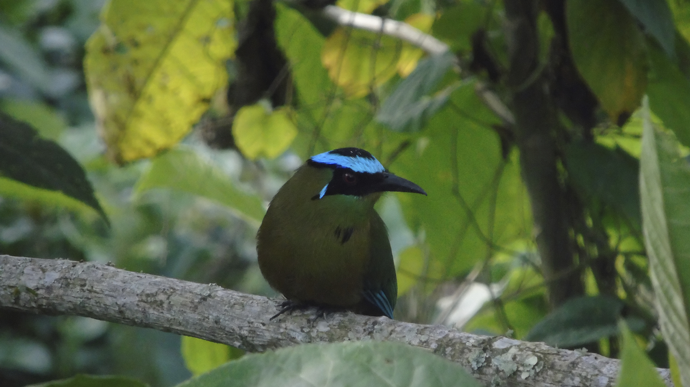
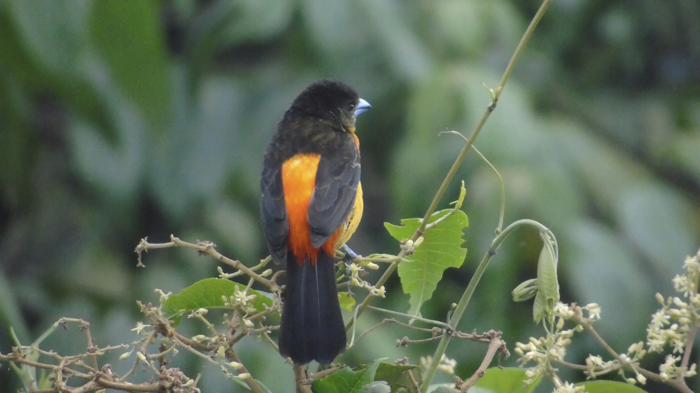

 Genial! 💚

 La clasificación se realiza con dos aves caracteristicas de Caldas, Colombia **(El Momotus_Aequatorialis y el Ramphocelus_flammigerus)**

> El Momotus Aequatorialis

> El Ramphocelus Flammigerus

### Ambiente Virtual en conda
➜  aves_clasificacion conda create --name aves_clasificacion

(aves_clasificacion) ➜  aves_clasificacion conda activate aves_clasificacion

### Instalacción de librerias
(aves_clasificacion) ➜  aves_clasificacion conda install tensorflow

(aves_clasificacion) ➜  aves_clasificacion conda install pillow

(aves_clasificacion) ➜  aves_clasificacion pip install tf-nightly

(aves_clasificacion) ➜  aves_clasificacion python3 -m pip install matplotlib

(aves_clasificacion) ➜  aves_clasificacion conda install -c conda-forge matplotlib

**Creación del archivo train.py**

(aves_clasificacion) ➜  aves_clasificacion python3 train.py

### Referencias

* https://keras.io/examples/vision/image_classification_from_scratch/

**Código**

* https://github.com/sandrarairan/Clasificaci-n_imagen_desde_cero

### Resultado

Epoch 50/50
* 4/4 [==============================] - 23s 6s/step - loss: 0.0357 - accuracy: 0.9904 - val_loss: 2.0885 - val_accuracy: 0.3462

**This image is 95.85 percent Momotus_Aequatorialis and 4.15 percent Ramphocelus_flammigerus**

