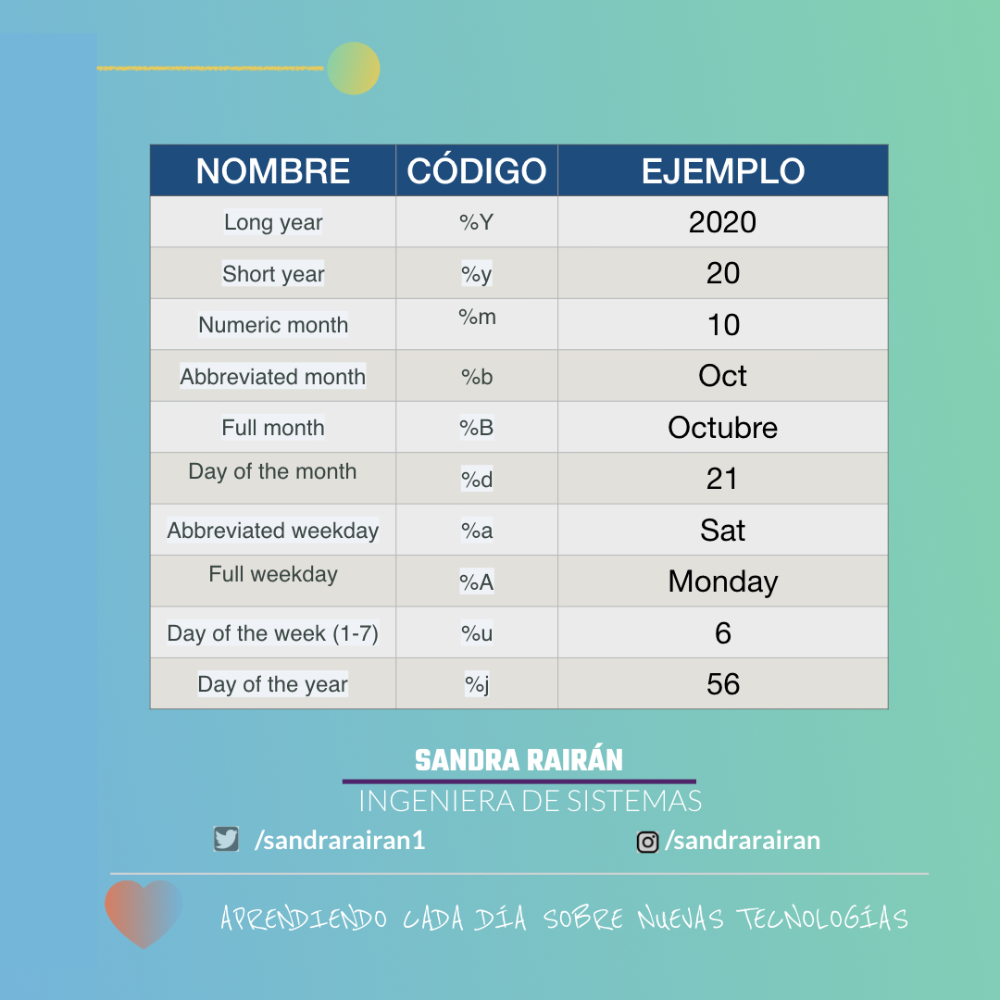
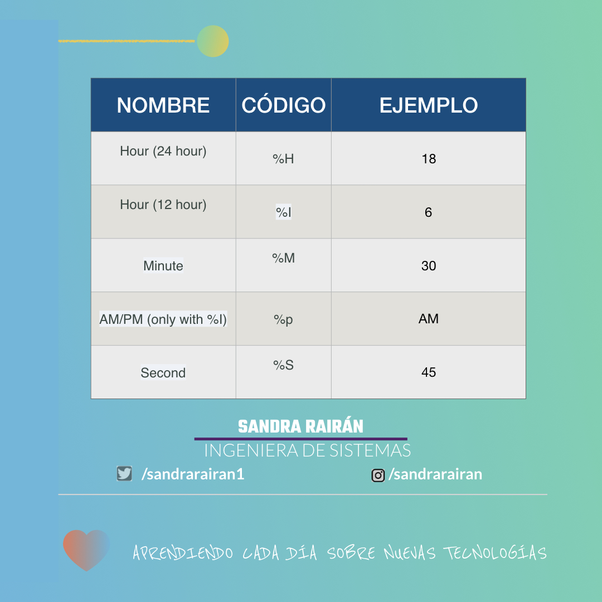
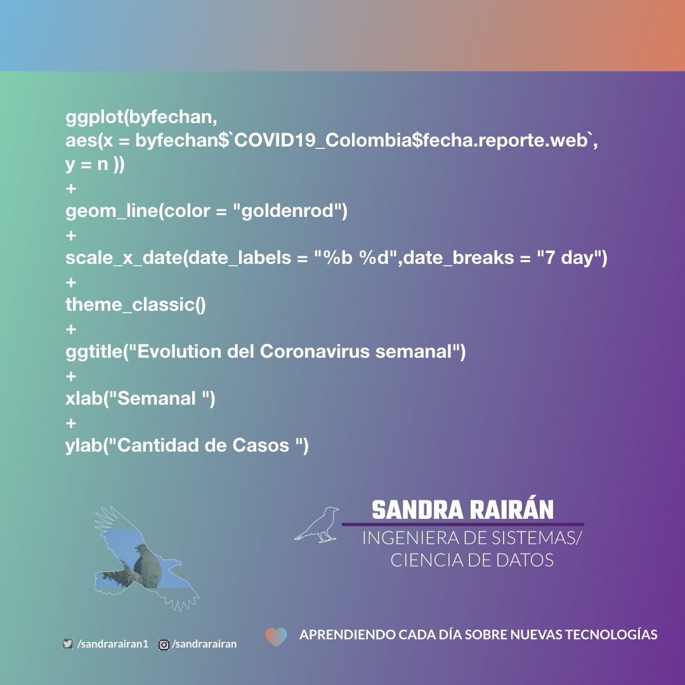
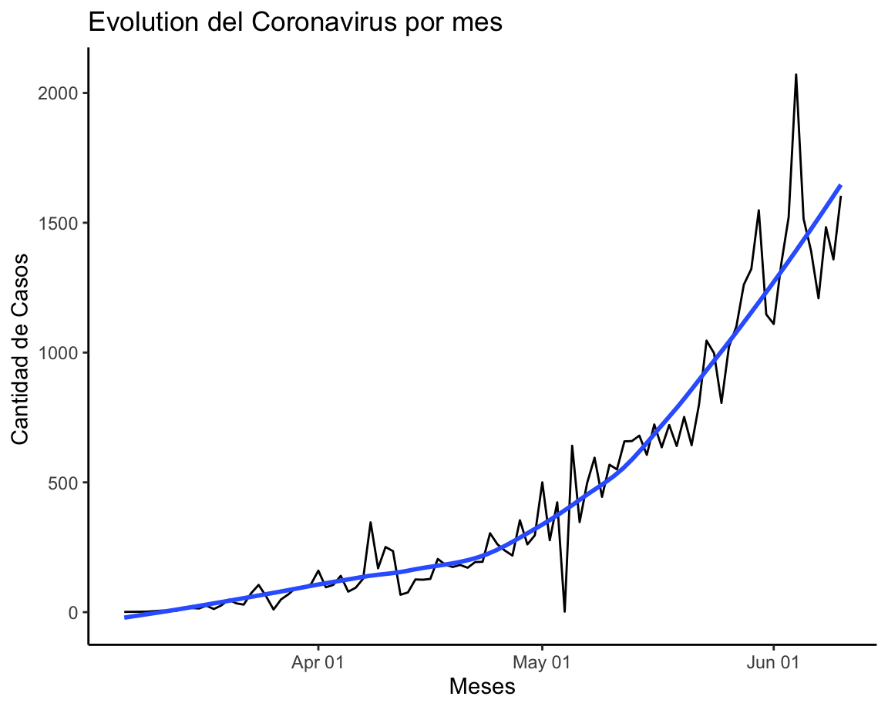
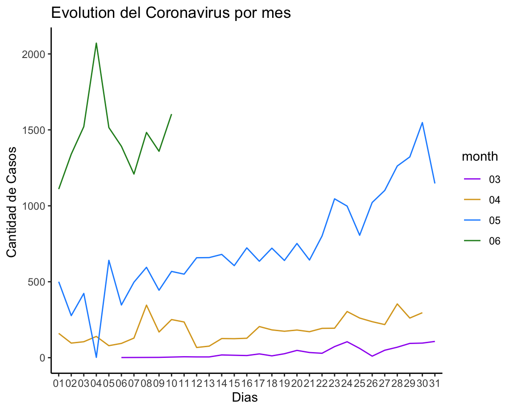

 Formato Date o POSIXct que debe tener los datos en time series, visualización y Análisis estadístico de Time series.

 Los datos Date son utiles para ggplot2 y para time series, de igual manera existen códigos de fechas como  **(%Y, %m, %d, etc,)**

Tabla de referencia a para fechas:


* Las Fechas y horarios (2020-06-11 18:30:45) tambien es útil, POSIXct se usa adcionar el horario.

Tabla de referencia hora:


### Visualización Time Series (ggplot2)
* Para utilizar time series con ggplot2 se requier el uso de **scale_x_date()**



```python
ggplot(byfechan, 
aes(x = byfechan$`COVID19_Colombia$fecha.reporte.web`, 
y = n )) 
+
geom_line(color = "goldenrod") 
+
scale_x_date(date_labels = "%b %d",date_breaks = "7 day") 
+
theme_classic()
+
ggtitle("Evolution del Coronavirus semanal") 
+
xlab("Semanal ") 
+
ylab("Cantidad de Casos ")
```

### Descomposicion series temprales
```python
 ggplot(byfechan, aes(x = byfechan$`COVID19_Colombia$fecha.reporte.web` , y = n )) +
	geom_line() +
	scale_x_date(date_labels = "%b %d") +
  geom_smooth(method = "loess", se = FALSE, span = 0.6) +
	theme_classic()+
  ggtitle("Evolution del Coronavirus por mes") +
    xlab("Meses") +
    ylab("Cantidad de Casos ")
```


### Patron seasonal

```python
# Make the plot
seasonal <- ggplot(byfechan, aes(x =day_num , y = n , group = month, color = month)) +
	geom_line(aes(color = month)) +
	theme_classic() + 
	scale_color_manual(values=c("purple", "goldenrod", "dodgerblue", "forestgreen","darkviolet"))+
  ggtitle("Evolution del Coronavirus por mes") +
    xlab("Dias ") +
    ylab("Cantidad de Casos ")
seasonal
```


##### “Fuente: Portal de Datos Abiertos www.datos.gov.co”, la fecha de la última de 10 junio de 2020

