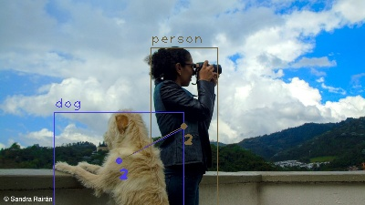
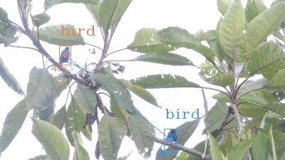
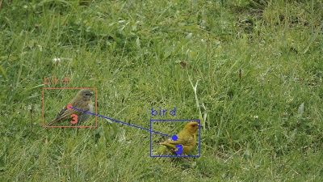
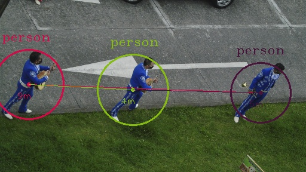
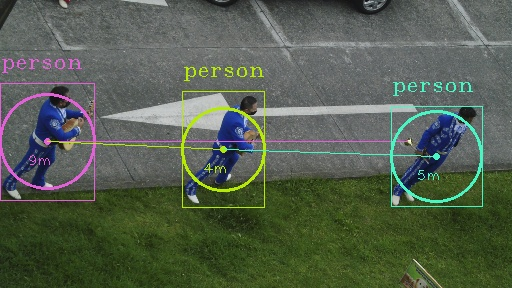

Wow!💻
**Cereza y yo pajareando y aplicando CV** 🦆 ☘️ 🦜



**Para la instalación de OpenCv en MAC me base en estos links:** 😃

([Instalación en Mac](https://docs.opencv.org/master/d0/db2/tutorial_macos_install.html))

([Instalación en MAC](https://www.pyimagesearch.com/2018/08/17/install-opencv-4-on-macos/))

### Es necesario utilizar los weights y la  cfg de yolo

* Se debe descargar los pesos y cfg, adicionarlos en la carpeta del proyecto, utilice el model YOLOv3-608.

([Descargar los weights y cfg](https://pjreddie.com/darknet/yolo))


Adicionalmente, es necesario decargar los coco.names, las clases de los objetos creados en el modelo entrenado por yolo. Para descargarlo en este link: ([coco names](https://github.com/pjreddie/darknet/blob/master/data/coco.names/))


### Genial!!!  Imagenes  con Computer Vision! 🦆☘️🦜
**Tangara Gyrola**


**Sicales Flaveola**


**Distanciamiento Social**




#### El código se encuentra en mi cuenta de github: 😃😃

([Código](https://github.com/sandrarairan/Deteccion_Objetos/))

#### Calcule la distancia entre dos puntos de cada objeto detectado
```Python
def distancia_puntos_caja(x,y, x1,y1):
       return sqrt((x1 - x) ** 2 + (y1 - y) ** 2)
```
* y dibujo la distancia entre los objetos,se la distancia se dibuja de color rojo cuando la distancia es menor a 1.5 metros

```Python
distenmetros = distancia/39.37 #convertir los pixels a metros					
distanciasolcial = int(distenmetros)
if distanciasolcial <  1.5: #menor a 1.5 metros el rectangulo de pinta de rojo
   cv2.rectangle(img, (x,y), (x+w, y+h), color_texto, 2)
```


##### cite: 
 "Cite: @article{yolov3,
  title={YOLOv3: An Incremental Improvement},
  author={Redmon, Joseph and Farhadi, Ali},
  journal = {arXiv},
  year={2018}
}