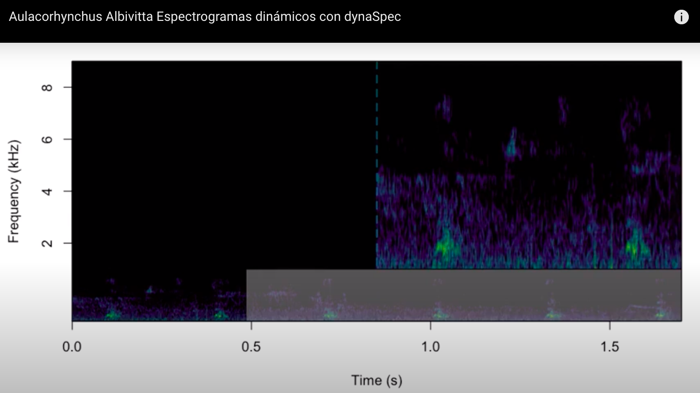

## Videos de espectogramas dinámicos

Utilice dynaSpec : Un conjunto de herramientas para generar visualizaciones de espectrogramas dinámicos en formato de video.
**Ejemplo del Espectograma dinámico del ave conocoda como Gallina Ciega**

https://www.youtube.com/channel/UCsDn6QIdIOBFJKIi2gV4F9w

###### Cite: Araya-Salas M y M. Wilkins. (2020), dynaSpec: visualizaciones espectrograma dinámicos en R . Paquete R versión 1.0.0.

